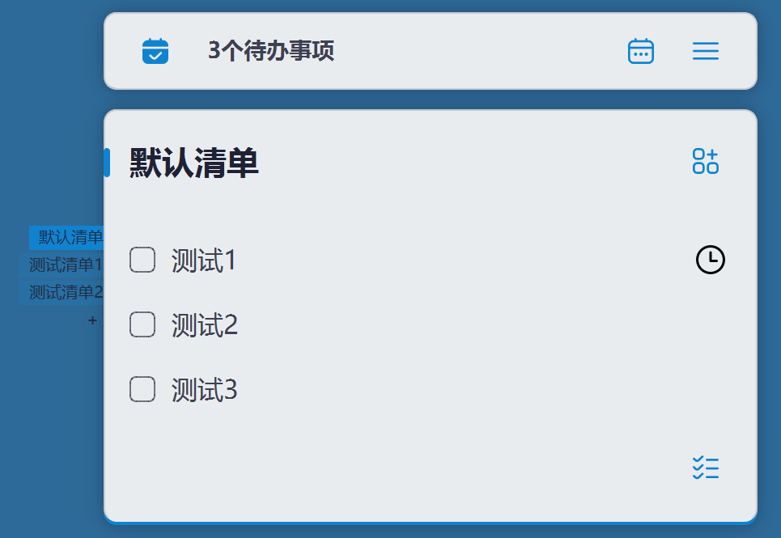

# TodoList

<p align="center">
  
</p>

基于 [PyQt-SiliconUI](https://github.com/ChinaIceF/PyQt-SiliconUI/) 的跨平台桌面待办应用，在原作者项目基础上做了功能与体验上的扩展。

## 致谢与来源

本仓库由 **[ChinaIceF / My-TODOs](https://github.com/ChinaIceF/My-TODOs)** 衍生而来，界面与基础架构受益于原作者的开源工作；UI 组件库为 **PyQt-SiliconUI**。若你引用或二次分发本仓库，请同时保留对原作者与 GPL v3 的说明。

## 当前功能概览

### 待办与清单

- **多清单**：可创建多个清单、侧栏切换；支持重命名、排序（置顶/上移下移）、删除（至少保留一个清单）。
- **待办项**：勾选完成、内联添加、编辑内容；支持将单条待办**移动到其他清单**。
- **批量操作**：一键**全部完成**当前清单。
- **数据格式**：`todos.ini` 使用 JSON（多清单结构），并**兼容**旧版 `<TODO-START-MARK>` 纯文本格式。

### 提醒与日历

- **提醒**：为单条待办设置日期与时间；支持**不重复 / 每天 / 每周 / 每月**，以及**重要程度**（不重要 / 重要 / 紧急）；快捷选项含「30 分钟后」「明天 9 点」「本周日」「下周一」等。
- **到时通知**：后台定时检查，到期弹出提醒窗口（未完成项）。
- **独立日历窗口**：月视图查看带提醒的待办；可在日历中编辑、切换完成、删除及调整提醒。

### 窗口与系统集成

- **系统托盘**：主窗口为无边框工具窗口，通常**不占用任务栏按钮**；托盘菜单可显示窗口、最小化、退出；Windows 下可勾选**开机自启动**（当前用户「运行」注册表项）。
- **外观**：**深色模式**、**半透明模式**及透明度滑块；可**锁定窗口位置**防止误拖。
- **可读性**：待办正文字号可调（像素，约 8–24）。

### 配置与数据位置

- 首次运行会在系统**「文档」目录下创建 `TodoList` 文件夹**，并将程序目录中的 `options.ini` / `todos.ini` **复制**到该处（若不存在），之后读写均针对用户目录，便于升级程序而不丢数据。


## 如何使用
* 在右侧下载最新的 Release，解压并运行即可
* 如果你需要开机自启，请参照网上的方法将本应用添加到自启


### 从源码运行
在项目根目录安装依赖（需已安装 Python 与 PyQt5 等，与 PyQt-SiliconUI 要求一致）后执行：

```bash
python start.py
```

### 自行打包（PyInstaller）

若官方 Release 无法在你的环境运行，可自行打包，例如：

```bash
pyinstaller start.py --noconsole
```

打包后请将 **`options.ini`、`todos.ini`** 以及 **`icons/icons.dat`** 放到可执行文件同目录（或与你的打包配置一致）；首次启动仍会向「文档/TodoList」同步配置。具体路径以实际报错为准。

## 第三方资源

部分图标来自 [Flaticon](https://flaticon.com)。

## 许可证

本项目沿用 **GNU General Public License v3.0**（见仓库内 `LICENSE`）。转载或再发布时请保留许可证全文及对原作者项目的引用。
